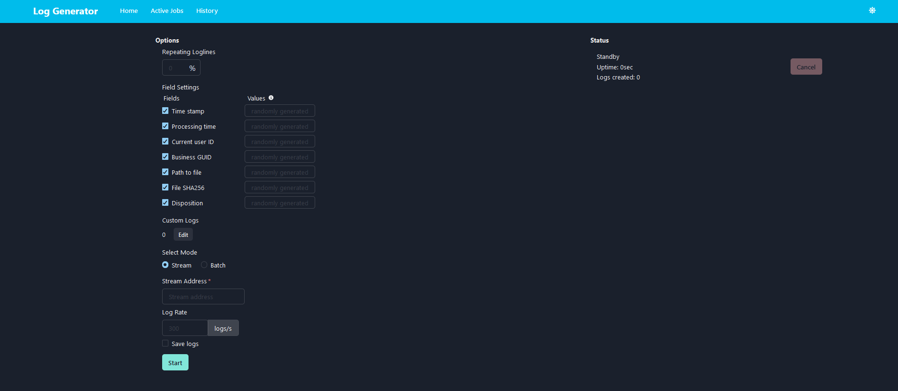
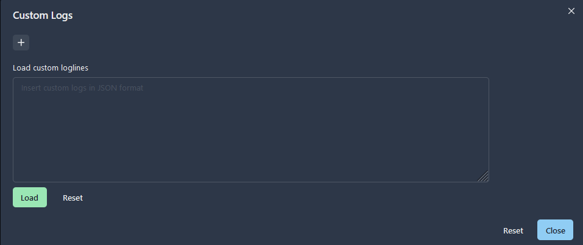
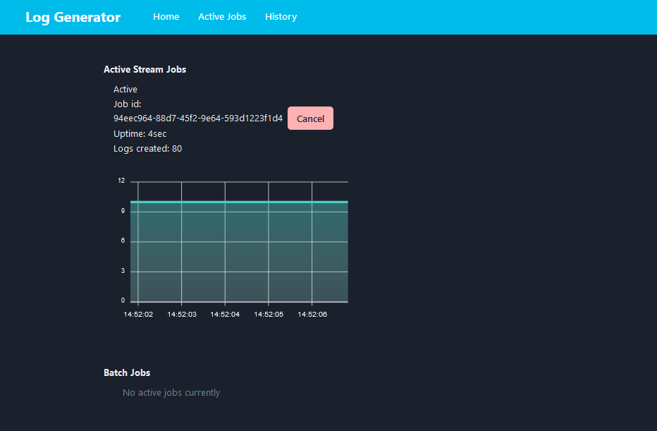
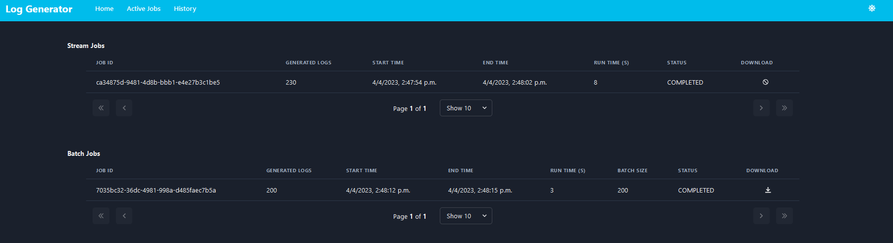

# Random Log Generator
Repository containing tools for generating semi-randomized computer telemetry (or log data)

# Team Members
- Chinwe Ajieh
- Florian Bache
- Ling Lee
- David Zarinski
- Advisor: Andy Wu

# Deployment
### Overview
The full stack application is deployed via AWS ECS with self-managed EC2 instances using an automated Jenkins pipeline. Below is an overview of the steps required to do so:  
- Dockerfiles are used to create docker images of both the frontend and backend. These images are uploaded to AWS Elastic Container Repository (ECR)
- An Elastic Container Service (ECS) cluster is created and utilized as a container orchestration and management tool
- The ECS deploys both the frontend and backend images to containers which run on two different EC2 instances

### Implementation
#### Configure AWS 
Prior to running the Jenkins pipeline, AWS must be configured as outlined below.  
<b>Note:</b> These configuration steps only need to be completed once.
- ECR (Elastic Container Repository)
  - Create lg-backend repository
  - Create lg-frontend repository
- ECS (Elastic Container Service)
  - Create Cluster
    - EC2 Linux + Networking
      - Cluster name: ad1EcsCluster
      - EC2 instance type: t2.micro
      - VPC (create new)
        - CIDR: 10.0.0.0/16
        - Subnet 1: 10.0.0.0/24
        - Subnet 2: 10.0.1.0/24
      - Security Group (create new)
      - Container instance IAM role
        - Create new role
  - Task definitions
    - Create ad1-back task definition
      - Requires compatibilities
        - EC2
      - Task execution IAM role (create new)
      - Task size 
        - Task memory: 800 MiB
        - Task cpu: 1024
      - Add container
        - Container name: ad1-back
        - Image: copy lg-backend image URI from ECR (latest)
        - Port mappings: 8080:8080
        - Environment variables
          - S3 credentials: accessKey + secretKey
          - EC2 instance URL: frontendURL
    - Create ad1-front task definition
      - Requires compatibilities
        - EC2
      - Task execution IAM role (create new)
      - Task size 
        - task memory: 800 MiB
        - task cpu: 1024
      - Add container
        - Container name: ad1-front
        - Image: copy lg-frontend image URI from ECR (latest)
        - Port mappings: 80:3000
        - Environment variables
          - EC2 instance URL: backendURL
  - Services
    - Navigate to created cluster. Under Services tab click Create
        - Backend service
          - Launch type: EC2
          - Task Definition: ad1-back
          - Revision: latest
          - Service name: ad1-back
          - Number of tasks: 0
        - Frontend service
          - Launch type: EC2
          - Task Definition: ad1-front
          - Revision: latest
          - Service name: ad1-front
          - Number of tasks: 0
- EC2
  - Elastic IPs
    - backend
      - Allocate Elastic IP address
      - name backend
    - frontend
      - Allocate Elastic IP address
      - name frontend 
  - Security Groups
    - Create security group
      - Security group name: ad1
      - VPC: Same as created in Cluster above
      - Inbound rules:
        - IP version Type Protocol Port range Source Description
        - All traffic	All	All	default	–
        - IPv4	HTTPS	TCP	443	0.0.0.0/0	–
        - IPv4	Custom TCP	TCP	8080	0.0.0.0/0	–
        - IPv6	HTTP	TCP	80	::/0	–
        - IPv6	Custom TCP	TCP	8080	::/0	–
        - IPv4	HTTP	TCP	80	0.0.0.0/0	–
        - IPv6	HTTPS	TCP	443	::/0
  - EC2 instances
    - Create frontend instance
      - Application and OS Images: Ubuntu
      - Instance type: t2.micro
      - Network settings
        - Network: VPC created in cluster above
        - Subnet: Subnet created above
        - Select existing Security group: Security group created above
      - Name instance frontend after creation
      - Navigate to Elastic IPs - associate an IP with the EC2 instance
    - Create backend instance
      - Application and OS Images: Ubuntu
      - Instance type: t2.micro
      - Network settings
        - Network: VPC created in cluster above
        - Subnet: Subnet created above
        - Select existing Security group: Security group created above
      - Name instance frontend
      - Navigate to Elastic IPs - associate an IP with the EC2 instance

#### Configure Jenkins
Jenkins must be configured to allow you to run the pipeline.  
<b>Note:</b> Jenkins must be installed on your system and the application launched. Download all standard plugins when prompted during install.
1. Navigate to the port specified during installation (i.e., localhost:8080)
2. Sign in with your credentials
3. Navigate to `Dashboard`->`Manage Jenkins`->`Plugin Manager` and download the following plugins:
   1. CloudBees AWS Credentials Plugin
   2. Docker: Docker API, Commons, Pipeline and plugin Plugins
   3. AWS: EC2 + SDK, ECR + SDK, ECS SDK and IAM SDK plugins
4. Navigate to `Dashboard`->`Manage Jenkins`->`Credentials` and enter in the following credentials:
   1. github_PAT
   2. jenkins-aws-admin
   3. jenkins-aws-s3
5. In the dashboard click `New Item`, select `Pipeline` and enter a pipeline name (e.g., LogGenPipeline)
6. Navigate to `Dashboard`->`LogGenPipeline`->`Configure` and enter the following configurations:
   1. `GitHub project`->`Project url`: https://github.com/andymbwu/log-generator
   2. `Pipeline`
      1. `Definition`: Pipeline script from SCM
      2. `SCM`: Git
      3. `Repository URL`: https://github.com/andymbwu/log-generator
      4. `Branches to build`->`Branch Specifier (blank for 'any')`: */main
      5. `Script Path`: JenkinsFile

#### Deploy the full stack application
To deploy the full stack application for the first time or for future updates follow the steps outlined below:
1. Open the Docker Desktop Application on your computer
2. Launch Jenkins
3. Run the pipeline by navigating to `Dashboard`->`LogGenPipeline` and selected `Build Now`

4. The full stack application is now launched and can be accessed by the EC2 instance URLs + port number + API address (applicable to backend)
   1. For example, frontendURL to landing page: http://ec2-52-38-219-170.us-west-2.compute.amazonaws.com/
   2. For example, backendURL to stats API: http://ec2-100-20-95-225.us-west-2.compute.amazonaws.com:8080/api/v1/generate/stats

# Using the application

## Home Page

#### Configuring loglines to be generated
- Repeating Loglines
  - `%`Enter the percentage of repeating loglines. The percentage entered will be used as a probability that the next line is repeating.
- Field Settings
  - `Time stamp`
  - `Processing time`
  - `Current user ID`
  - `Business GUID`
  - `Path to file`
  - `File SHA256`
  - `Disposition`
- Custom Logs
  - `Edit` - press the edit button
  
    - In the pop-up window, in JSON format copy loglines into the text box

#### Selecting a mode
- Stream mode
  - Stream Address: Specify a `Stream Address` to stream to
  - Log Rate: Specify a log rate in logs/s
  - Save logs: Select the checkbox if you'd like to save the streamed logs to file (S3 bucket)
  - Click `Start`
- Batch mode
  - Number of Logs: Specify the number of logline to be included in the batch file
  - Click `Start`

## Active Jobs Page

## History Page

